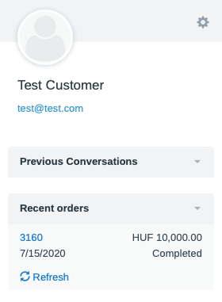

FreeScout WooCommerce
=============

This is a proof-of-content solution to display WooCommerce orders on the sidebar of a FreeScout conversation related to the current customer(based on the e-mail address).

##### Demo

Check this site for a quick demo: https://passatgt.github.io/gdpr-cookie-notice/

##### How it works?

1. Download the repo and copy it into the FreeScout's Modules folder(make sure the folder name is WooCommerce)
2. Edit the Config/config.php file to enter your WooCommerce REST API public and private key. Also the domain, like https://test.com/ (make sure it ends with a /)
3. Enable the module in FreeScout
4. Check out a conversation and it will automatically download the most recent orders of the customer and it will be displayed on the sidebar with a quick link to the order details page

